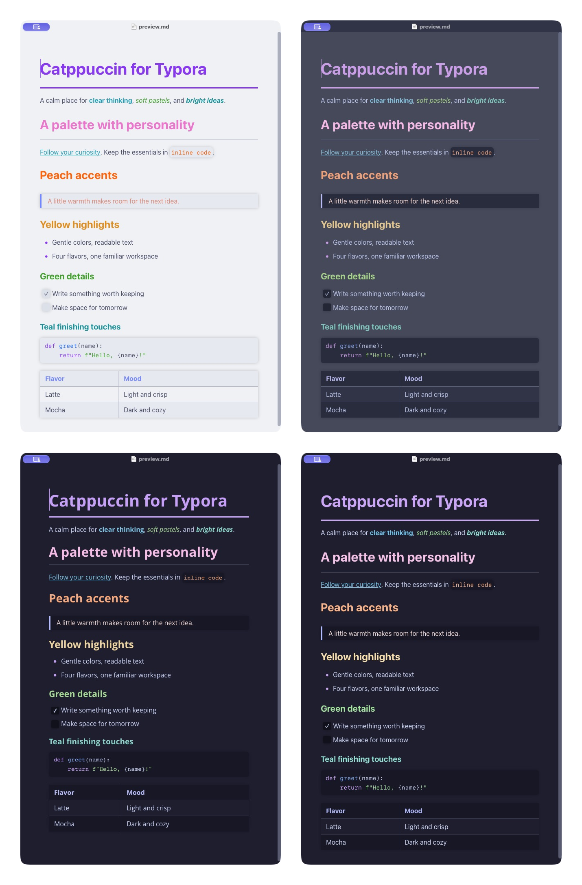
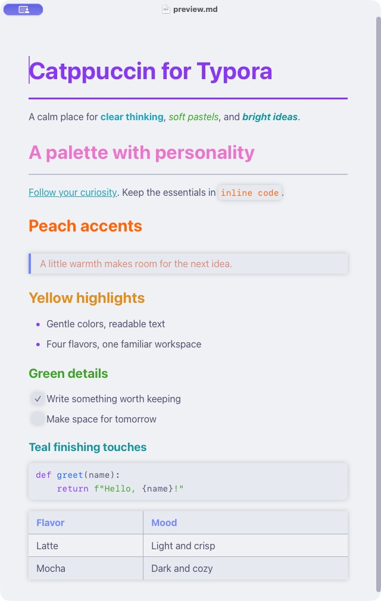
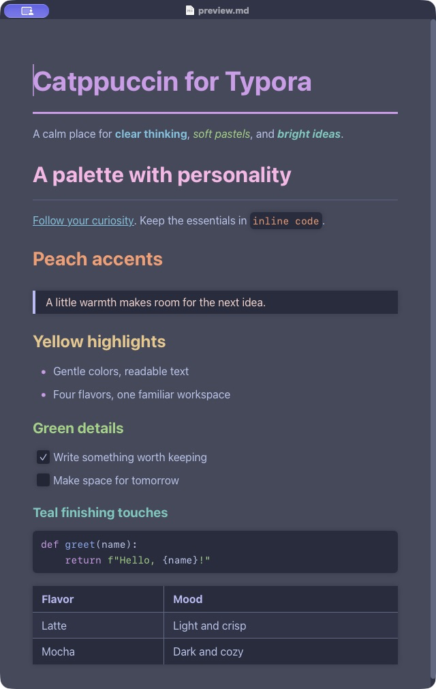
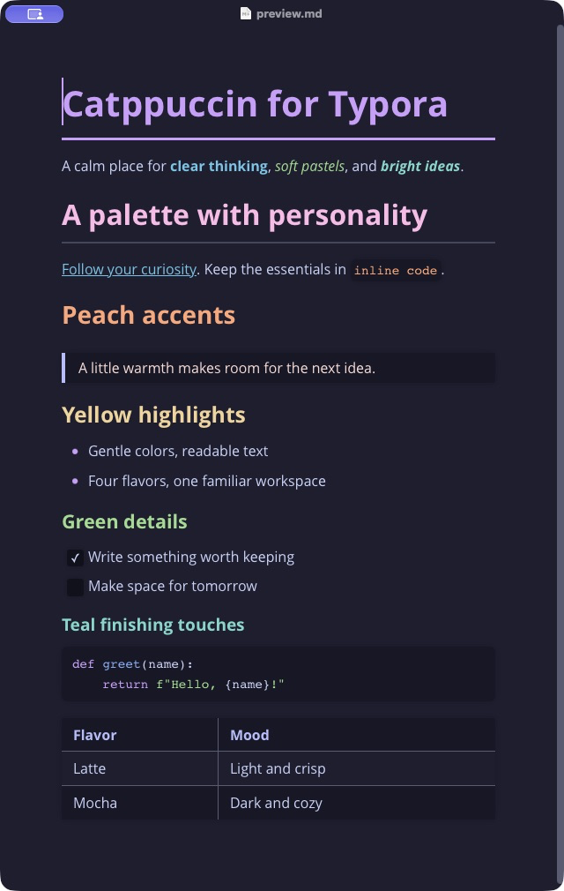
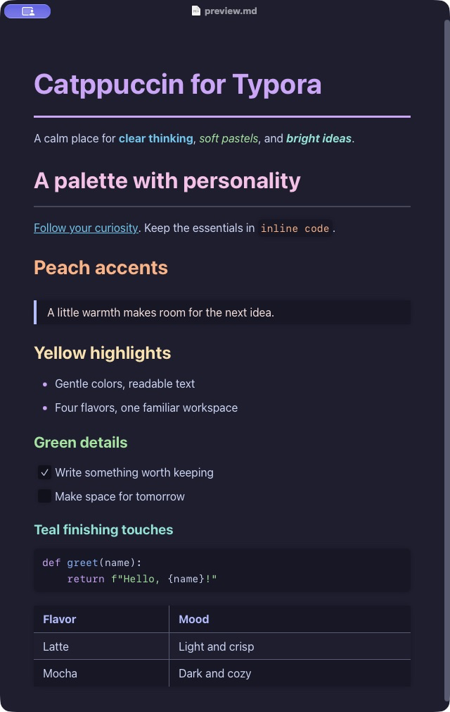

<h3 align="center">
	 
	
	Catppuccin for <a href="https://typora.io">Typora</a>
	
</h3>

	
	
	

## Previews

🌻 Latte

🪴 Frappé

🌺 Macchiato

🌿 Mocha

## Usage

1. Download this repository as a ZIP and extract it.
2. In Typora, open **Preferences → Appearance → Open Theme Folder**.
3. Copy the **contents** of `themes/` into that folder: all four CSS files and the `catppuccin` directory.
4. Restart Typora and select **Catppuccin Latte**, **Frappé**, **Macchiato**, or **Mocha** from **Themes**.

## Features

- Four standard Catppuccin palettes with their original backgrounds and accents.
- Pastel heading hierarchy, sapphire bold text, green italics, and rosewater quotes.
- Themed sidebar, tables, code blocks, syntax highlighting, and diagrams.
- System fonts; no external fonts or network requests required by the theme.

### Optional darker Macchiato

Copy `extras/catppuccin-macchiato-dark.css` into your theme folder alongside the standard themes. This custom blend uses Mocha backgrounds with Macchiato text and accents.
It is an extra, not the standard Macchiato palette.

## Compatibility

Developed for Typora on macOS.
The four packaged flavors were visually checked with headings, links, emphasis, quotes, tasks, tables and Python code.
Windows and Linux have not been tested.
Dialogs, print/export layouts, and diagrams still need a broader compatibility check.
The preview document is `examples/preview.md`.

## Attribution

This port builds on [Stephan Lamoureux's Typora theme](https://github.com/stephanlamoureux/typora-catppuccin), under the MIT license.
Visible accent styling was developed by Mike Wille, with inspiration from [Catppuccin for Obsidian](https://github.com/catppuccin/obsidian).
The repository structure follows [Catppuccin's template](https://github.com/catppuccin/template).

Community port draft; not yet adopted or endorsed by the Catppuccin organization.

## 💝 Thanks to

- [Mike Wille](https://github.com/mikefwille)
- [Stephan Lamoureux](https://github.com/stephanlamoureux)
- [Catppuccin community](https://github.com/catppuccin)

&nbsp;

	

	Copyright &copy; 2021-present <a href="https://github.com/catppuccin" target="_blank">Catppuccin Org</a>

	

